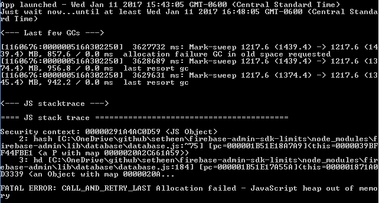

# firebase-admin-sdk-limits
Small app illustrating existing firebase-admin SDK limitations

## Summary
This simple app synchronizes three firebase keys by watching for `child_changed` events.  After running for an hour, garbage collection will identify an "out of memory" exception.



## Setup

``` bash
npm install
npm start
```